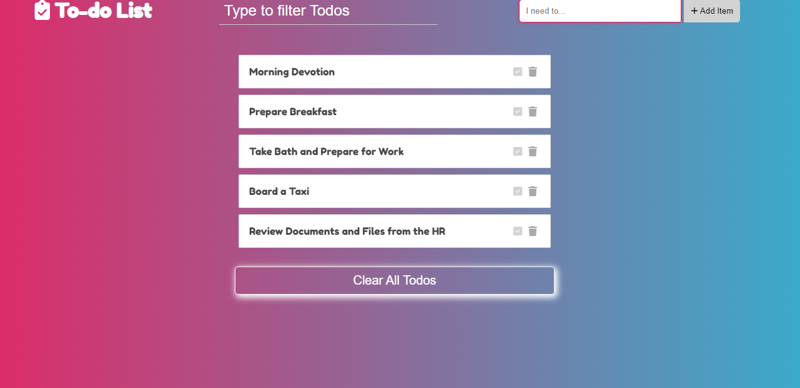

# Todo List App

A simple and intuitive Todo List app built with JavaScript, featuring local storage integration.

## Features

- Add new tasks to your todo list
- Mark tasks as completed
- Delete tasks from your todo list
- Filter tasks by keyword
- Responsive design for mobile and desktop

## Local Storage Integration

The Todo List app leverages the Local Storage Web API to store todo items locally in the user's browser. This allows the user's todo list to persist even after closing or refreshing the browser. Todo items are stored as JSON strings in the browser's local storage and are retrieved and displayed when the app is loaded.

## Future Enhancements

- Implement user authentication to allow multiple users to have their own todo lists.
- Add the ability to prioritize tasks or categorize them into different lists.
- Integrate with a backend server to sync todo lists across devices.

## Installation

1. Clone the repository: `git clone https://github.com/your-username/todo-list-app.git`
2. Open `index.html` in your web browser.

## Usage

1. Enter a task in the input field and press Enter or click the "Add" button to add it to your todo list.
2. Click the checkbox next to a task to mark it as completed.
3. Click the "Delete" button next to a task to remove it from your todo list.
4. Use the filter input to search for todos by Keyword.

## Demo

## Contributing

Contributions are welcome! If you have any suggestions or improvements, please open an issue or submit a pull request.

## Credits

- Font Awesome Icons: Used for icons in the todo list UI. [Font Awesome](https://fontawesome.com/)

## License

This project is licensed under the [MIT License](LICENSE).

## Contact

For any questions or inquiries, please contact [ndukelex4@gmail.com](mailto:ndukelex4@gmail.com).
